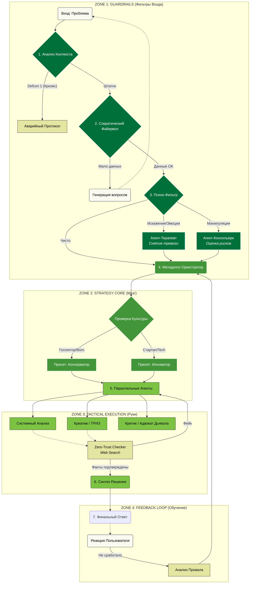

# Epistemic Engine

**Корпоративная система принятия решений на базе мульти-агентной архитектуры**

---

### О проекте

**Epistemic Engine** — это интеллектуальная система поддержки принятия решений (DSS), разработанная для сложной корпоративной среды. В отличие от стандартных чат-ботов, система не просто генерирует текст, а проводит глубокий многоэтапный анализ проблемы, имитируя когнитивные процессы экспертной группы.

Архитектура построена на базе **LangGraph** и реализует принцип «разделения властей» между специализированными агентами, что позволяет минимизировать галлюцинации, устранить когнитивные искажения и обеспечить безопасность решений.

### Архитектура Процесса

Система работает по конвейерному принципу, проходя через 4 зоны контроля и обработки:



### 🧩 Ключевые Модули

#### ZONE 1: GUARDRAILS (Безопасность и Контекст)
Первая линия обороны. Прежде чем решать задачу, система проверяет её валидность.
*   **Сократический Файервол**: Если запрос нечеткий, система не пытается угадать, а задает уточняющие вопросы.
*   **Психо-Фильтр**: Детектирует эмоциональную окраску и манипуляции. Если пользователь в стрессе, подключается `Агент-Терапевт`.

#### ZONE 2: STRATEGY CORE (Стратегия)
Адаптация под корпоративную культуру.
*   **Культурный Пресет**: Система меняет стиль решения в зависимости от контекста ("Госсектор" требует строгости и соблюдения регламентов, "Tech" — гибкости и скорости).

#### ZONE 3: TACTICAL EXECUTION (Тактика)
Параллельная работа специализированных экспертов:
*   **ТРИЗ-Агент**: Ищет нестандартные решения через инверсию и дробление.
*   **Системный Аналитик**: Ищет "бутылочные горлышка" и ресурсные ограничения.
*   **Критик (Devil's Advocate)**: Оценивает риски (финансовые, репутационные, юридические).
*   **Синтезатор**: Объединяет противоречивые мнения в единый сбалансированный вердикт.

---

### 🚀 Быстрый Старт

#### Требования
*   Python 3.10+
*   Доступ к OpenRouter API (или OpenAI API)

#### Установка

1.  **Клонируйте репозиторий:**
    ```bash
    git clone https://github.com/your-repo/epistemic-engine.git
    cd epistemic-engine
    ```

2.  **Установите зависимости:**
    ```bash
    pip install -r requirements.txt
    ```

3.  **Настройте окружение:**
    Создайте файл `.env` в корне проекта и добавьте ваш API ключ:
    ```bash
    OPENROUTER_API_KEY=sk-or-v1-....................
    # Опционально: модель (по умолчанию gpt-4o)
    LLM_MODEL=openai/gpt-4o
    ```

4.  **Запуск:**
    ```bash
    python main.py
    ```

---

### 🛠 Технологический Стек

*   **LangGraph**: Оркестрация stateful-графов и управление состоянием агентов.
*   **LangChain Core**: Базовые абстракции для работы с LLM.
*   **OpenRouter**: Единый шлюз для доступа к передовым моделям (GPT-4o, Claude 3.5 Sonnet).
*   **Rich**: Библиотека для создания профессионального TUI (Text User Interface).
*   **Tenacity**: Обеспечение надежности и отказоустойчивости (Retries).

---
*Developed for Enterprise AI Solutions.*
